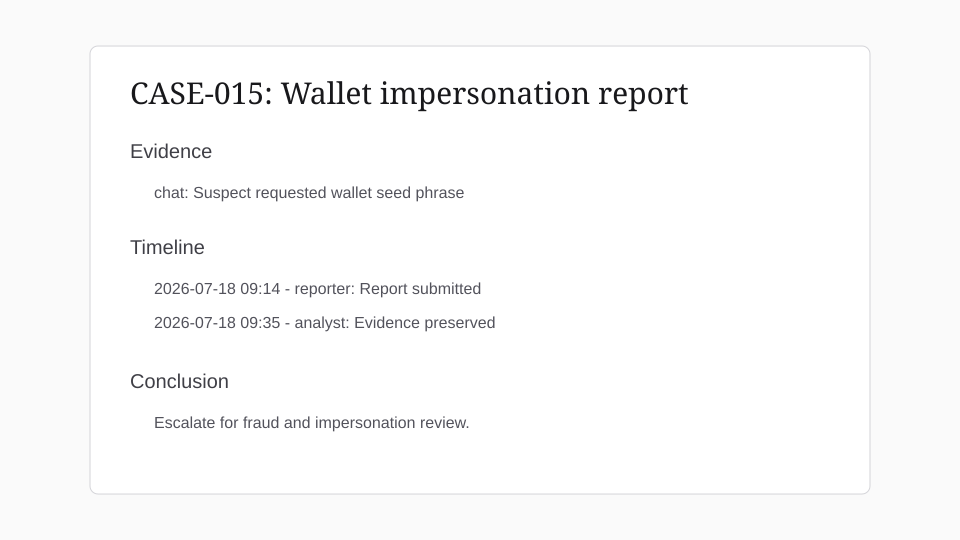
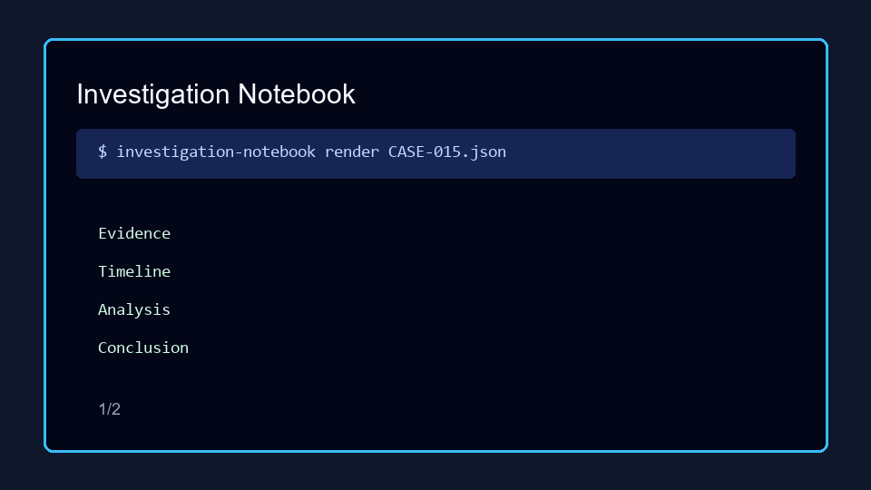
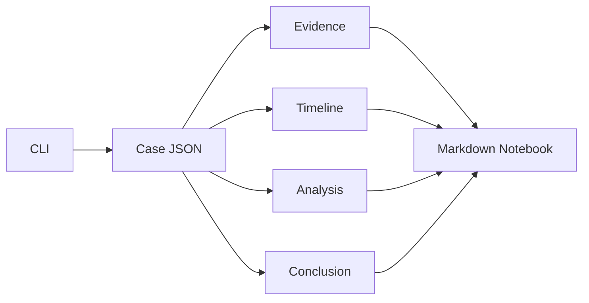

# Investigation Notebook

Case notebook CLI for abuse investigations. It keeps evidence, timeline entries, analysis notes, and conclusions in a structured case file that can be rendered to Markdown for review.





## Features

- Create structured investigation case files
- Add evidence with source, hash, and description fields
- Add timeline events with timestamps and actors
- Add analysis notes and conclusions
- Render professional case notebooks to Markdown
- Keep case data portable as JSON

## Architecture Diagram



## Installation

```bash
python -m venv .venv
.venv\Scripts\activate
pip install -e .
```

## Usage

```bash
investigation-notebook new CASE-015 --title "Wallet impersonation report"
investigation-notebook evidence CASE-015.json --source chat --description "Seed phrase request"
investigation-notebook timeline CASE-015.json --timestamp "2026-07-18 09:14" --event "User report opened"
investigation-notebook render CASE-015.json --out CASE-015.md
```

## Roadmap

- Add attachments directory management
- Add chain-of-custody signatures
- Add Markdown import
- Add encrypted case archives

## Known Issues

- The tool does not encrypt case files by default.
- Timestamp validation is intentionally permissive for investigator flexibility.

## Contributing

See [CONTRIBUTING.md](CONTRIBUTING.md).

## License

MIT. See [LICENSE](LICENSE).
